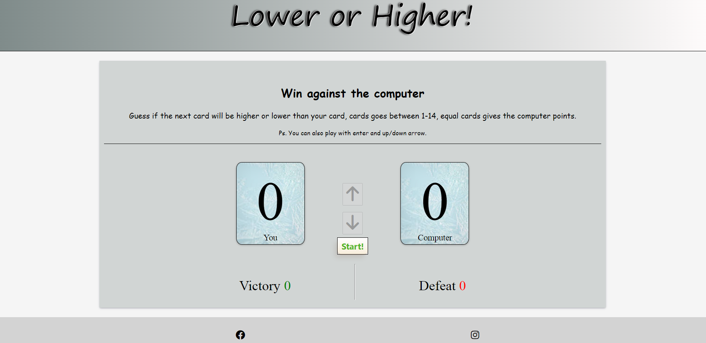
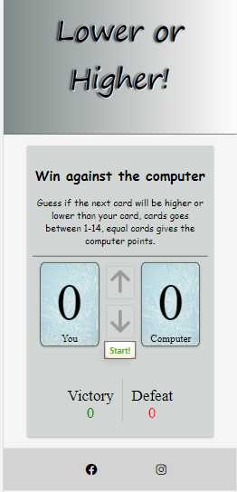
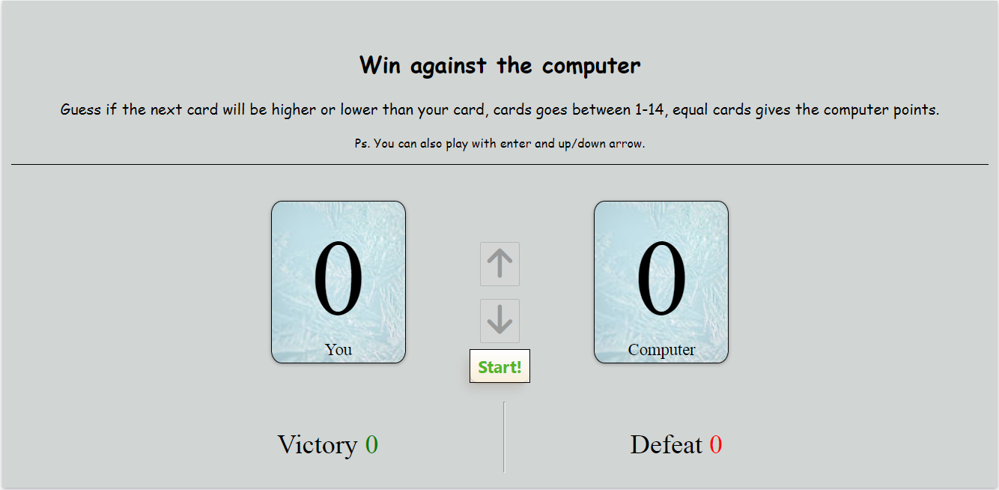

# Lower or Higher!

Lower or higher is a card game made for people who like to waste time trying to win against the computer. People tend to have different ways to relax after for example a busy day at work. There are people that feel that games like this are de-streesing and that's the people this card game is trying to target.

The rules are simple:
*  The computer hands you a card when you press start between 1-14.
* The user guess using the arrow buttons if the next card will be higher or lower than the one laying.
* Either the user or the computer wins and scores are calculated.

  

## Features

### The Heading
The heading is very simple to not draw the attention from the game, it only contain the games name to move the attention futher down to the game.

### The Gamefield
The gamefield displays a bow where all the user needs to know and do are inculded.

#### Rules
The rules informs the player of how the game is built.

#### Cards
The two cards will show the users number to the left and the computers number to the right.

#### Buttons
The three buttons are for the user guess, higher or lower and to start the game.

#### Scoreboard
The scoreboard shows the user how many victories and/or defeats they have against the computer.

  ### Testing 
  * This page is tested on androids and iphones with the style it's informed to, it works in firefox, chrome but not in explorer. 
  * Page changes size on elemtents to receive good UX no mather the screen.
  * Page is tested to see if all function is working.
  * Start button is the only button enable when entering the page.
  * Start button disabled after being used to make the user make a game guess. 
  * Start button is enabled again after users guess and a score is added to either victory or defeat depending on if the user or the computer won. 

  In the begining of my testing the scores wheren't given to the right winner. I hadn't target the num1 and num2 in parseInt which wasn't making in the look of it but when looked in the conslole js changed place of num1 and num2 when calculating the score.

  

  #### Validator Testing

  This game is tested in both [W3C-validator](https://validator.w3.org/) and [W3C-CSS-validaor](http://jigsaw.w3.org/css-validator/validator?lang=sv&profile=css3svg&uri=https%3A%2F%2Fohdamnitsnikki.github.io%2Fnew-parent%2F&usermedium=all&vextwarning=&warning=1)
  

    

    

 

#### Deployment
The card game was deployed through github pages.
* In github repository go to settings.
* Go to pages and use the branch menu to change to main.
Refresh teh page and a link to the final project is deployed.

Live link here - [Card Game](https://ohdamnitsnikki.github.io/card_game/)

* On the main site there is a fork button to create your own repository without affecting the orginal project or you could go into the project file and use the code button and clone the project directly.

### Credits

1. The template is taken from [Code Institute](https://github.com/Code-Institute-Org/gitpod-full-template)
2. For help during these projects I've used my mentor and the love math project.
3. The box shadow is taken from [Get css scan](https://getcssscan.com/css-box-shadow-examples)#19
4. To understand how to style img in readme file I've used code from [SeanCDavid](https://www.seancdavis.com/posts/three-ways-to-add-image-to-github-readme/)
5. The code to being able to use enter, down and up buttons in the game is taken from [W3School](https://www.w3schools.com/howto/howto_js_trigger_button_enter.asp)
6. Styling for the header is inspired by [Log Rocket](https://blog.logrocket.com/five-cool-css-header-styles-with-cross-browser-compatibility/)

### Media
The image for the game cards is taken from [Team renewable artic Finland](https://teamrenewablearctic.fi/2021/04/23/new-climate-targets-announced/)